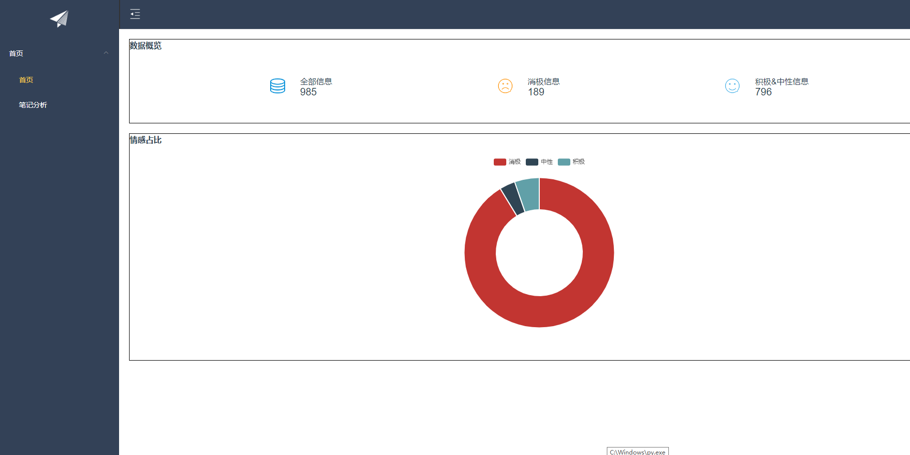
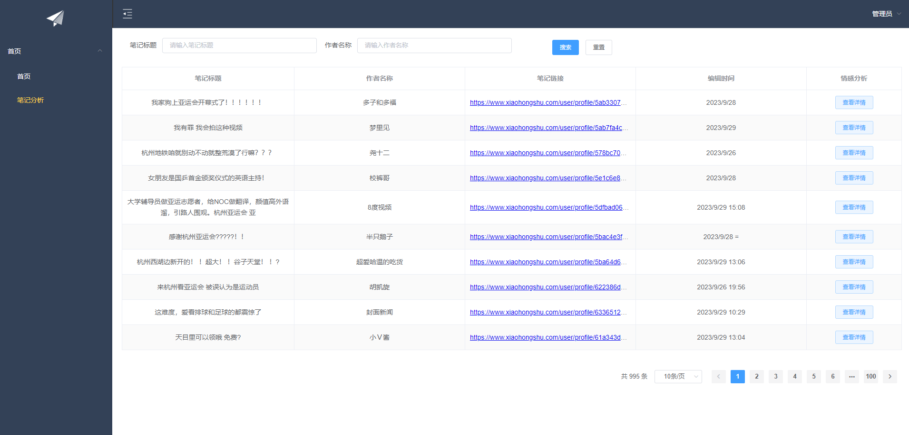
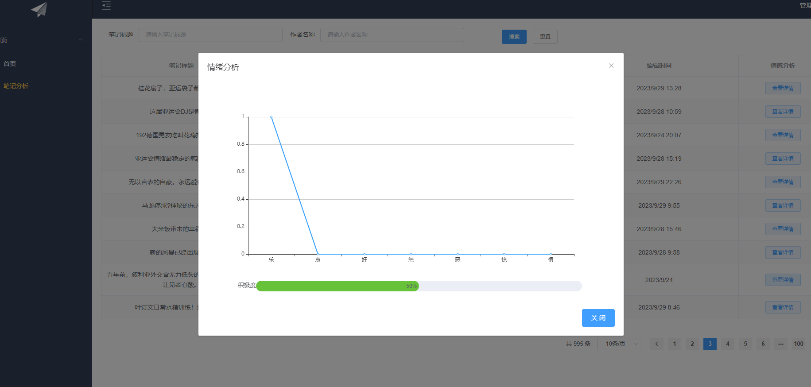

基于Python的小红书话题情感分析系统（程序+论文）
=
- 完整代码获取地址：从戎源码网 ([https://armycodes.com/](https://armycodes.com/))
- 作者微信：19941326836  QQ：952045282
- 承接计算机毕业设计、Java毕业设计、Python毕业设计、深度学习、机器学习
- 选题+开题报告+任务书+程序定制+安装调试+论文+答辩ppt 一条龙服务
- 所有选题地址https://github.com/nature924/allProject

一、项目介绍
---
基于Python实现的小红书话题情感分析系统，该系统对小红书平台的现有话题进行爬虫，对评论内容进行情感分析，主要功能如下。

### 管理员：
- 基本操作：登录、查看系统内部数据（进行情感占比分析以及数据概览）
- 爬虫模块：手动获取某一条话题下方的评论内容，并存入数据库中
- 评论分析模块：获取评论标题、词云图、以及情感分析柱状图和情绪占比图

二、项目技术
---
- 编程语言：Python
- 项目架构：B/S架构
- 前端技术：ElementUI、Vue、Vuex、Axios、Vue-Router
- 后端技术：MySQL、Python、Flask、jieba，cnsenti

三、运行环境
---
- 操作系统：Windows、macOS都可以
- Python版本：3.7及以上都可以
- 操作系统：Windows7/10、MacOS
- 开发工具：IDEA、Ecplise、MyEclipse都可以
- 数据库: MySQL5.5/5.7/8.0版本都可以

四、运行截图

### 程序截图：

